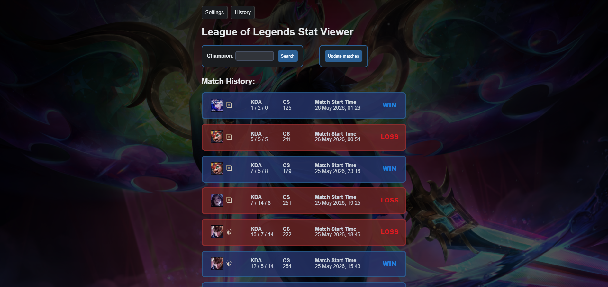
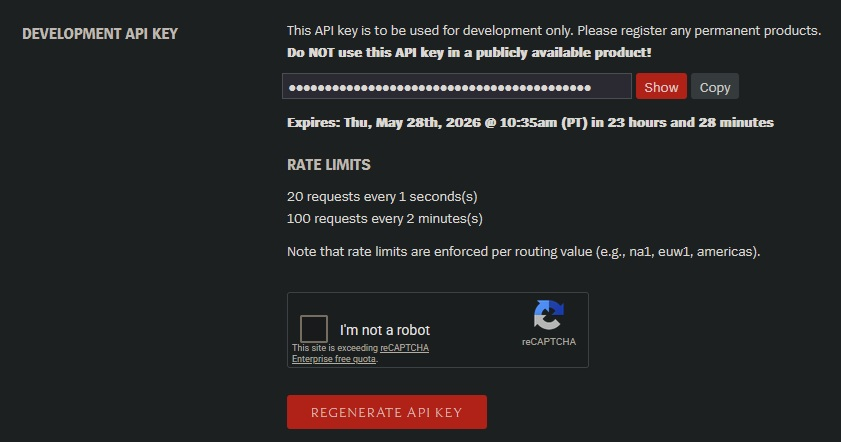
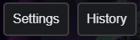
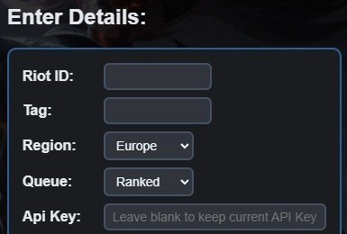
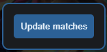
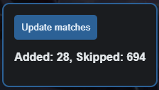
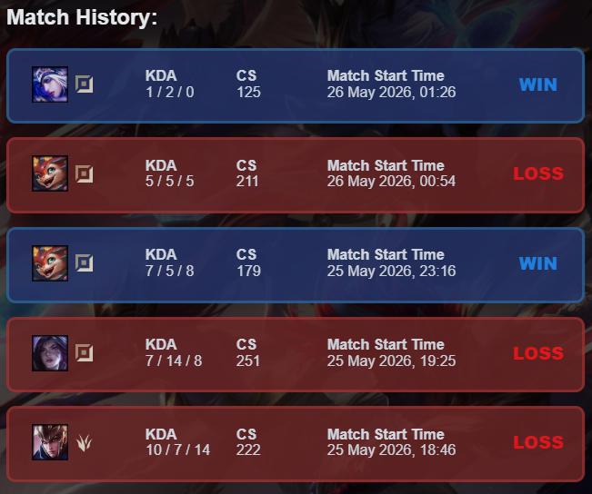
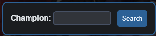
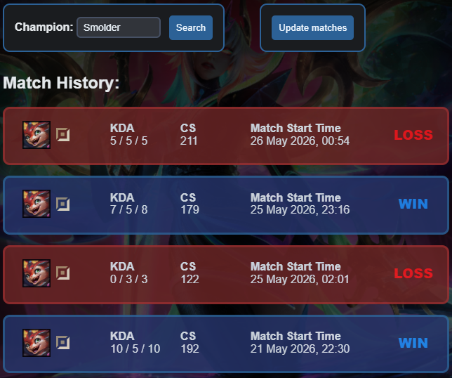
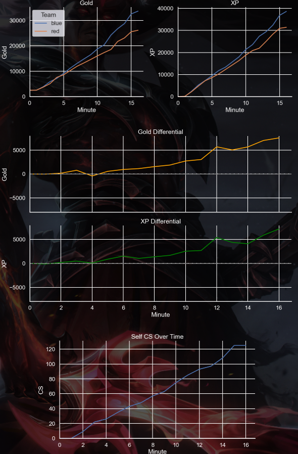

# League of Legends Stat Tracker

## About the Project
  
**League of Legends Stat Tracker** is a local analytics application that collects match data through the Riot APIs, stores it in a SQLite database, and provides a Flask web interface for viewing statistics and visualising performance.


## Features
- Champion-Specific Filtering
- Gold and XP Timeline Visualisation
- Gold/XP Differential Analysis
- CS Tracking over Time
- Match History Tracking
- SQLite Local Database Storage
- Riot API Integration
- Duplicate Match Prevention
- Modular Ingestion Pipeline

## Built With
   
  
  
   


## Table of Contents
- [League of Legends Stat Tracker](#league-of-legends-stat-tracker)
  - [About the Project](#about-the-project)
  - [Features](#features)
  - [Built With](#built-with)
  - [Table of Contents](#table-of-contents)
  - [Getting Started](#getting-started)
    - [Obtain a Riot API Key](#obtain-a-riot-api-key)
    - [Prerequisites](#prerequisites)
    - [First Time Setup](#first-time-setup)
  - [Usage](#usage)
    - [Match History](#match-history)
    - [Search by Champions](#search-by-champions)
    - [Graphs](#graphs)
      - [Gold and XP Graphs](#gold-and-xp-graphs)
      - [Gold and XP Differential Graphs](#gold-and-xp-differential-graphs)
      - [Self CS Over Time Graph](#self-cs-over-time-graph)
  - [Architecture](#architecture)
  - [Project Structure](#project-structure)
  - [License](#license)
  - [Disclaimer](#disclaimer)


## Getting Started

To get a local copy running, follow these steps.

### Obtain a Riot API Key

1. Create a Riot Account and login to: https://developer.riotgames.com/

2. On the main page, regenerate the API key and store it for later:  

> Take note: the Riot API Key expires every 24 hours, so it must be regenerated every 24 hours to use the application. There is no workaround as it is a personal API key. Read more: https://developer.riotgames.com/docs/portal and https://developer.riotgames.com/docs/lol

### Prerequisites
1. Install Python 3+ (Preferably the latest version) from: [Python Download Link](https://www.python.org/downloads/)

2. Clone the repository:  
```bash
git clone https://github.com/ryanjj-chew/LeagueTracker
```

3. Create a Virtual Environment (venv) in the Root of the Cloned Repository in Powershell:  
```bash
cd LeagueTracker
python -m venv .venv
```

4. Activate the Virtual Environment:  
```bash
.venv\Scripts\activate
``` 
> Note: On Microsoft Windows, it may be required to enable the Activate.ps1 script by setting the execution policy for the user. You can do this by issuing the following PowerShell command:  
`PS C:\> Set-ExecutionPolicy -ExecutionPolicy RemoteSigned -Scope CurrentUser`  
Please refer to https://docs.python.org/3/library/venv.html for more information.

5. Install the prerequisites:
```bash
pip install -r requirements.txt
```

6. Run the App:  
```bash
python app.py
```

7. Open the Flask server in Google Chrome/Microsoft Edge:  
```bash
http://127.0.0.1:5000
```

### First Time Setup
1. Open the `Settings` Page from the Navigation Bar:  


1. Enter your Player Details and the Previously Stored API key:  


1. Click `Save Settings` below Api Key:  


1. Go to the `History` Page from the Navigation Bar:  


1. No matches will be found initially. Click `Update Matches`:  
  

1. Do not leave the page until `Added: X, Skipped: Y` appears below `Update Matches`:  
  
> The updating of matches takes a while  because Riot API rate limits the searches to 20 requests every 1 seconds(s), or 100 requests every 2 minutes(s).

## Usage
### Match History

By default, all previous matches played will be displayed and sorted by most recent.  
  
  


### Search by Champions

With the search box, type any champion to get the list of matches played with that specific champion.  
  
  

It will then display all matches played with that specific champion sorted by most recent.  

Here is an example with the champion `Smolder`:


### Graphs
Click on any match to view the more in-depth statistics:  


#### Gold and XP Graphs
Each graph represents each team's gold and xp throughout the match. Blue refers to your team, Red refers to the enemy team.

#### Gold and XP Differential Graphs
Each graph shows the net difference in gold and xp, where a positive number means your team has more gold/xp than the enemy team, and vice versa.

#### Self CS Over Time Graph
The graph shows your personal CS (Creep Score) over the game's duration, useful for seeing downtime and inefficiencies across the game.

## Architecture
The following shows the pipeline of the entire project:
```text
Riot API
    │
    ▼
Match Ingestion
    │
    ▼
SQLite Database Storage
    │
    ▼
Pandas Data Processing
    │
    ▼
Seaborn + Matplotlib Graphs
    │
    ▼
Flask Web Interface
```
It uses a fully modular structure with each module of the pipeline separate from one another. This allows easier debugging and understanding of the purpose of each code section.

## Project Structure
```text
LeagueTracker/
|
|-- app.py                      # Flask application
|-- api.py                      # Base API for finding PUUID
|-- database.py                 # SQLite database processes
|-- dataframe.py                # Pandas data processing
|-- graph.py                    # Graph Generation
|-- session_flask.py            # Session/Update Pipeline
|-- match_ingester_flask.py     # Stores matches from API
|
|-- templates/                  # Jinja2 HTML templates
|-- static/                     # CSS and graphs
|-- data/                       # SQLite DB and JSON data
|
|-- requirements.txt
|-- README.md
```

## License
This project is licensed under the MIT License.

## Disclaimer
League Stat Tracker is not endorsed by Riot Games and does not reflect the views or opinions of Riot Games or anyone officially involved in producing or managing Riot Games properties. Riot Games and all associated properties are trademarks or registered trademarks of Riot Games, Inc